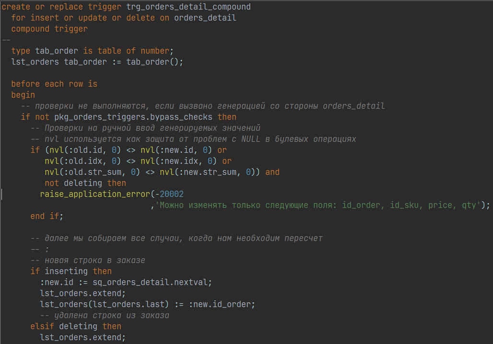

# plsql_developer_idea_theme

Theme, settings & rules for Allround Automations PL/SQL Developer 15. Consists of beautifier rules, colored highlighting, custom words and so on to code in the style of Intellij IDEA editor.

## Prerequisites

* PL/SQL Developer 15
* JetBrains Mono 2.2+

## Installation

* Download JetBrains Mono font from [official page](https://www.jetbrains.com/lp/mono/)
* Unpack and install fonts to Windows
* Open *Preferences* -> replace *Settings profile* with (settings.ini)
* Open *Preferences* -> *User Interface* -> *PL/SQL Beautifier*. Click open in *Rules file* and provide (beautifier_rules.br)
* Open *Preferences* -> *User Interface* -> *Editor* and in *Syntax Highlighing* tab click *Custom keywords* and open file (custom_keywords.txt)

## Notes

The PLSQL Developer color encoding is:
* Get your HEX color
* Convert each (red, green, blue) to DEC
* Sum it up as: Red + (Green * 256) + (Blue * 256 * 256)
* Resultinc DEC is a number for setting.ini
